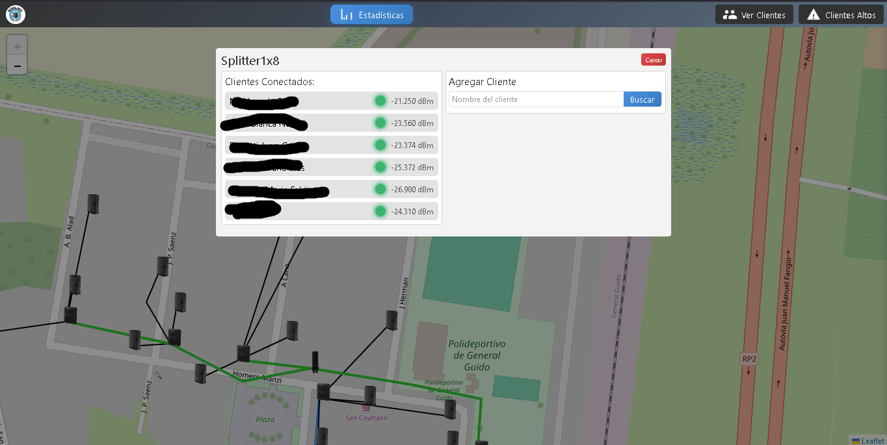

# 📡 FTTH NMS

## GPON Network Monitoring System

FTTH NMS es una plataforma desarrollada para monitorear redes FTTH/GPON, permitiendo visualizar el estado de ONUs, niveles ópticos y parámetros críticos de la infraestructura.

---

# 🎯 Objetivo

El objetivo del proyecto es centralizar información obtenida desde una red GPON y facilitar las tareas de diagnóstico y mantenimiento.

Permite detectar rápidamente:

- Clientes desconectados
- Niveles ópticos degradados
- Problemas de temperatura
- Distancias ópticas elevadas

---

# ⚙️ Funcionamiento

## 1. Recolección de datos

El módulo Collector se comunica con la OLT y obtiene información de las ONUs:

- Serial Number
- Estado de conexión
- RX Optical Power
- TX Optical Power
- Temperatura
- Distancia

## 2. Procesamiento

Los datos obtenidos son normalizados y enviados hacia la API backend para su almacenamiento y consulta.

## 3. Visualización

El frontend consume la API y presenta la información mediante dashboards y mapas interactivos.

---

# 🖥️ Dashboard

El panel permite consultar:

- Cantidad de ONUs activas
- Clientes offline
- Niveles ópticos críticos
- Información detallada de cada cliente

---

# 🗺️ Mapa FTTH

La visualización geográfica permite ubicar clientes dentro de la red y detectar zonas problemáticas.

---

# 🧩 Gestión de cajas y distribución FTTH

El sistema permite visualizar la relación entre la infraestructura de distribución y los clientes conectados.

Cada caja contiene información asociada:

- Clientes conectados
- Cantidad de abonados
- Estado de las ONUs
- Niveles ópticos
- Ubicación dentro de la red

Esto permite identificar rápidamente qué clientes están afectados ante una posible falla en un punto de distribución.

---

# 📊 Parámetros monitoreados

| Parámetro | Descripción |
|---|---|
| RX Power | Nivel óptico recibido por la ONU |
| TX Power | Potencia transmitida |
| Temperature | Temperatura del dispositivo |
| Distance | Distancia aproximada hacia la OLT |
| Status | Estado de conexión |

---

# 💡 Origen del proyecto

FTTH NMS nació a partir de una necesidad real dentro de una operación de red FTTH.

Durante las tareas diarias de soporte y mantenimiento era necesario contar con una herramienta que permitiera conocer rápidamente el estado de los clientes, detectar degradaciones ópticas y localizar posibles fallas dentro de la infraestructura.

A partir de esta necesidad se desarrolló una plataforma propia capaz de centralizar información proveniente de la red GPON y transformarla en información útil para el diagnóstico.

Actualmente permite:

- Identificar clientes sin conexión
- Detectar niveles ópticos fuera de rango
- Ubicar rápidamente zonas con problemas
- Consultar clientes asociados a cada caja de distribución
- Reducir tiempos de diagnóstico ante reclamos

El objetivo principal fue convertir datos técnicos de la red en una herramienta visual y práctica para la operación diaria.

---

# 🛠️ Tecnologías utilizadas

### Backend
- Laravel
- PHP
- MySQL

### Frontend
- React
- Vite
- Leaflet

### Networking
- GPON
- FTTH
- OLT Monitoring

---